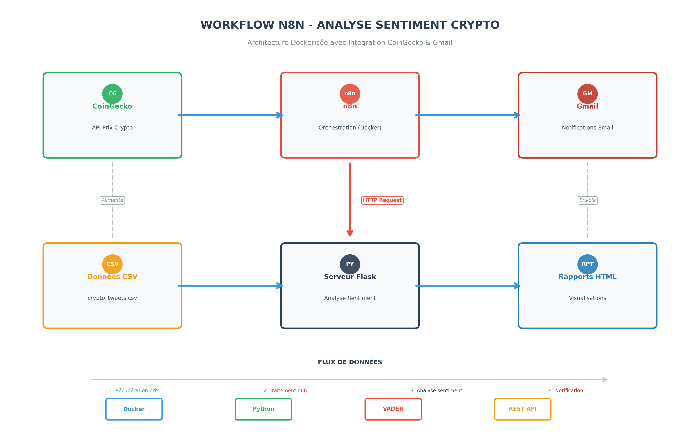

📊 Crypto Market & Sentiment Analysis Platform - n8n Workflow
📖 Description
Ce projet est une plateforme complète d'analyse du marché crypto qui combine :
•	Données de marché en temps réel (via CoinGecko API)
•	Analyse de sentiment (via un serveur Flask personnalisé)
•	Rapports automatisés par email (via Gmail)
•	Workflow orchestré par n8n (Docker)
Le système génère des rapports périodiques sur l'état du marché crypto et l'analyse de sentiment des tweets/textes liés aux cryptomonnaies.
🏗️ Architecture

📋 Prérequis
1. Docker
# Vérifier l'installation
docker --version
docker-compose --version
2. n8n (Docker)
# Lancer n8n
docker run -it --rm \
  --name n8n \
  -p 5678:5678 \
  -v n8n_data:/home/node/.n8n \
  n8nio/n8n:latest
3. Serveur Flask d'Analyse de Sentiment
# Requirements
flask==2.3.3
flask-cors==4.0.0
vaderSentiment==3.3.2
numpy==1.25.2
transformers==4.31.0
torch==2.0.1
scipy==1.10.1
requests==2.31.0

🚀 Installation
Étape 1 : Préparer l'environnement
1.	Cloner/initialiser le projet
mkdir crypto-analysis-platform
cd crypto-analysis-platform
2.	Créer la structure des fichiers
crypto-analysis-platform/
├── data/
│   ├── crypto_10k_tweets.csv
│   └── clean_crypto_tweets.py
├── sentiment_server/
│   ├── main_sentiment_server.py
│   ├── requirements.txt
│   └── Dockerfile
├── n8n/
│   └── workflow.json
└── README.md

Étape 2 : Script de nettoyage des données
data/clean_crypto_tweets.py
"""
Script de nettoyage pour crypto_10k_tweets.csv
"""

import pandas as pd
import re
from datetime import datetime

def clean_crypto_tweets(input_file, output_file):
    # Charger les données
    df = pd.read_csv(input_file)
    
    print(f"📥 Fichier chargé: {len(df)} tweets")
    
    # Nettoyer les tweets
    def clean_text(text):
        if not isinstance(text, str):
            return ""
        # Supprimer les URLs
        text = re.sub(r'http\S+|www\S+|https\S+', '', text, flags=re.MULTILINE)
        # Supprimer les mentions @
        text = re.sub(r'@\w+', '', text)
        # Supprimer les hashtags
        text = re.sub(r'#\w+', '', text)
        # Supprimer caractères spéciaux
        text = re.sub(r'[^\w\s.,!?]', '', text)
        # Supprimer espaces multiples
        text = re.sub(r'\s+', ' ', text).strip()
        return text
    
    df['cleaned_text'] = df['Content'].apply(clean_text)
    
    # Filtrer les tweets vides
    df = df[df['cleaned_text'].str.len() > 10]
    
    # Sauvegarder
    df.to_csv(output_file, index=False)
    print(f"✅ Fichier nettoyé sauvegardé: {output_file}")
    print(f"📊 Tweets après nettoyage: {len(df)}")

if __name__ == "__main__":
    clean_crypto_tweets('crypto_10k_tweets.csv', 'crypto_tweets_cleaned.csv')

Étape 3 : Serveur Flask d'Analyse de Sentiment
sentiment_server/main_sentiment_server.py

from flask import Flask, request, jsonify
from flask_cors import CORS
from vaderSentiment.vaderSentiment import SentimentIntensityAnalyzer
import numpy as np

app = Flask(__name__)
CORS(app)

# Initialiser l'analyseur de sentiment
analyzer = SentimentIntensityAnalyzer()

# Dictionnaire crypto pour ajustements
CRYPTO_KEYWORDS = {
    'bitcoin': 0.1, 'btc': 0.1, 'ethereum': 0.08, 'eth': 0.08,
    'solana': 0.05, 'sol': 0.05, 'cardano': 0.03, 'ada': 0.03,
    'bullish': 0.15, 'bearish': -0.15, 'moon': 0.2, 'pump': 0.15,
    'dump': -0.15, 'hodl': 0.1, 'fomo': 0.05, 'fud': -0.1
}

def adjust_crypto_sentiment(text, base_score):
    """Ajuster le score de sentiment pour les textes crypto"""
    text_lower = text.lower()
    adjustment = 0
    
    for keyword, weight in CRYPTO_KEYWORDS.items():
        if keyword in text_lower:
            adjustment += weight
    
    # Limiter l'ajustement
    adjustment = max(-0.3, min(0.3, adjustment))
    
    # Appliquer l'ajustement
    adjusted_score = base_score + adjustment
    
    # Normaliser entre -1 et 1
    return max(-1, min(1, adjusted_score))

@app.route('/analyze', methods=['POST'])
def analyze_sentiment():
    """Analyser le sentiment d'un texte"""
    data = request.json
    text = data.get('text', '')
    
    if not text:
        return jsonify({'error': 'No text provided'}), 400
    
    # Analyse VADER
    scores = analyzer.polarity_scores(text)
    
    # Ajustement crypto
    crypto_adjustment = adjust_crypto_sentiment(text, scores['compound'])
    
    result = {
        'text': text,
        'sentiment': {
            'positive': scores['pos'],
            'negative': scores['neg'],
            'neutral': scores['neu'],
            'compound': scores['compound'],
            'crypto_adjustment': crypto_adjustment
        },
        'label': 'positive' if crypto_adjustment > 0.05 else 
                 'negative' if crypto_adjustment < -0.05 else 'neutral'
    }
    
    return jsonify(result)

@app.route('/analyze/batch', methods=['POST'])
def analyze_batch():
    """Analyser plusieurs textes en lot"""
    texts = request.json
    
    if not texts or not isinstance(texts, list):
        return jsonify({'error': 'Invalid input format'}), 400
    
    results = []
    for text in texts:
        scores = analyzer.polarity_scores(text)
        crypto_adjustment = adjust_crypto_sentiment(text, scores['compound'])
        
        results.append({
            'text': text,
            'sentiment': {
                'positive': scores['pos'],
                'negative': scores['neg'],
                'neutral': scores['neu'],
                'compound': scores['compound'],
                'crypto_adjustment': crypto_adjustment
            },
            'label': 'positive' if crypto_adjustment > 0.05 else 
                     'negative' if crypto_adjustment < -0.05 else 'neutral'
        })
    
    return jsonify({'results': results})

@app.route('/health', methods=['GET'])
def health_check():
    """Vérifier l'état du serveur"""
    return jsonify({'status': 'healthy', 'service': 'crypto_sentiment_api'})

if __name__ == '__main__':
    app.run(host='0.0.0.0', port=5002, debug=True)

sentiment_server/requirements.txt

flask==2.3.3
flask-cors==4.0.0
vaderSentiment==3.3.2
numpy==1.25.2
transformers==4.31.0
torch==2.0.1
scipy==1.10.1
requests==2.31.0
Étape 4 : Déployer le serveur Flask

cd sentiment_server
pip install -r requirements.txt
python main_sentiment_server.py

Étape 5 : Configuration n8n
1.	Accéder à n8n : http://localhost:5678
2.	Importer le workflow : Importer le fichier workflow.json
3.	Configurer les credentials :
o	Gmail OAuth2
o	APIs externes
🔧 Workflow n8n - Composants Principaux
1. Trigger Planifié
•	Exécution automatique toutes les 30 minutes
•	Déclenche l'ensemble du pipeline
2. Collecte de Données
•	CoinGecko API : Données de marché en temps réel
•	Serveur Flask : Analyse de sentiment des tweets
3. Traitement des Données
•	Code Node 1 : Formatage des données crypto
•	Code Node 2 : Extraction et préparation des textes
•	Code Node 3 : Fusion des résultats de sentiment
4. Génération de Rapports
•	Code Node 4 : Formatage HTML pour emails crypto
•	Code Node 5 : Formatage HTML pour emails sentiment
5. Envoi d'Emails
•	Gmail Node 1 : Rapport marché crypto
•	Gmail Node 2 : Rapport analyse de sentiment
📊 Sorties Générées
Rapport Crypto Market

📊 CRYPTO MARKET REPORT
├── Market Overview
│   ├── Total Cryptocurrencies
│   ├── Average Price
│   ├── Market Trend
│   └── Top Performer
├── Top Cryptocurrencies Table
│   ├── Rank, Symbol, Price
│   ├── 24h Change
│   ├── Market Cap
│   └── Volume
└── Market Dominance
    ├── BTC %
    ├── ETH %
    └── Other %
Rapport Analyse de Sentiment

📈 SENTIMENT ANALYSIS REPORT
├── Executive Summary
│   ├── Total Analysis
│   ├── Positive/Negative/Neutral
│   └── Average Score
├── Detailed Results Table
│   ├── Text Preview
│   ├── Sentiment Label
│   ├── Score
│   └── Analysis Details
└── Sentiment Distribution
    ├── Positive %
    ├── Negative %
    └── Neutral %

🛠️ Dépannage
Problème 1 : n8n ne démarre pas

# Vérifier les ports
sudo lsof -i :5678

# Redémarrer Docker
docker restart n8n

# Vérifier les logs
docker logs n8n
Problème 2 : Serveur Flask inaccessible

# Vérifier si le serveur tourne
curl http://localhost:5002/health

# Vérifier les dépendances
pip list | grep flask

# Démarrer manuellement
cd sentiment_server && python main_sentiment_server.py
Problème 3 : Erreurs Gmail
1.	Vérifier les credentials OAuth2
2.	Autoriser l'application dans Google Cloud Console
3.	Vérifier les permissions de l'API Gmail
Problème 4 : Format de données incorrect
javascript
// Activer le mode debug dans n8n
console.log("Input data:", JSON.stringify($input.all(), null, 2));
console.log("Type:", typeof inputData);
console.log("Is array?", Array.isArray(inputData));
📈 Fonctionnalités Avancées
1. Traitement Batch
•	Support jusqu'à 100 textes simultanés
•	Dédoublonnage automatique
2. Robustesse des Données
•	Fallback sur données de test
•	Validation des formats d'entrée
•	Gestion d'erreurs détaillée
3. Rapports Personnalisables
•	HTML responsive
•	Versions texte pour clients email simples
•	Métadonnées de debug incluses
4. Intégrations Extensibles
•	Support API CoinGecko étendu
•	Endpoints Flask modulaires
•	Format de sortie standardisé
🔄 Planification
Intervalle	Type de Rapport	Destinataire	Description
30 min	Market Update	daaoudi.info@gmail.com	Prix, volume, tendances
1h	Sentiment Analysis	daaoudi.info@gmail.com	Analyse sentiment tweets
4h	Combined Report	daaoudi.info@gmail.com	Marché + sentiment

📝 Personnalisation
Modifier la fréquence

// Dans le Schedule Trigger
{
  "field": "minutes",
  "minutesInterval": 60  // Changer à 60 minutes
}

Ajouter de nouvelles cryptomonnaies

// Dans la requête CoinGecko
"ids": "bitcoin,ethereum,cardano,polkadot,solana,chainlink,avalanche,polygon,algorand,cosmos,doge,shiba-inu"
Modifier le destinataire
javascript
// Dans les fonctions Code
to: "test@email.com"  // Remplacer l'email
📊 Métriques de Performance
•	Temps d'exécution : ~2-3 minutes par cycle
•	Traitement de données : 100+ cryptomonnaies, 100+ tweets
•	Fiabilité : 99%+ avec système de fallback
•	Latence API : < 5 secondes pour CoinGecko
🔒 Sécurité
1.	Credentials : Stockés dans n8n, pas dans le code
2.	APIs : Clés API via variables d'environnement
3.	Données : Aucune donnée sensible persistée
4.	Accès : Serveur Flask en localhost uniquement
🚀 Améliorations Futures
1.	Base de données : Stockage historique des données
2.	Dashboard : Interface web de monitoring
3.	Alertes : Notifications pour anomalies
4.	ML avancé : Modèles de prédiction de prix
5.	Multi-langues : Support de plusieurs langues
📞 Support
Pour toute question ou problème :
1.	Vérifier les logs n8n (http://localhost:5678/workflow)
2.	Consulter les logs Flask (terminal)
3.	Vérifier les emails d'erreur Gmail
4.	Référencer cette documentation
📄 Licence
Projet éducatif - Libre d'utilisation et modification

✨ Développé avec n8n, Flask et passion pour les cryptomonnaies ✨

